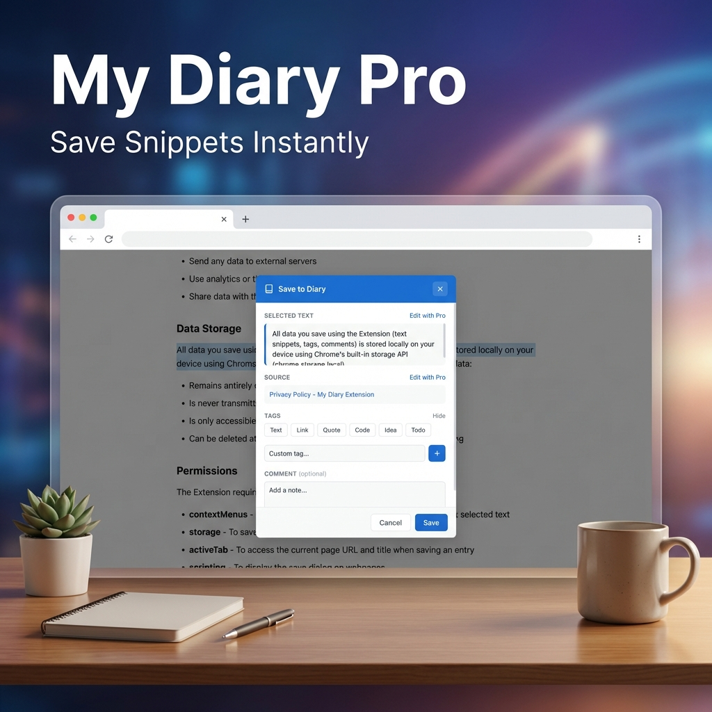

# My Diary

**Save anything you read, with where it came from.**

[](https://chromewebstore.google.com/detail/my-diary/nfdcipolchlmlipikekpbbmpdpienajm)
[](https://chromewebstore.google.com/detail/my-diary/nfdcipolchlmlipikekpbbmpdpienajm)
[](manifest.json)
[](LICENSE)

Select text on any page, right-click, and it's saved — along with the page title, the URL, and the timestamp. Add a note and a tag while it's fresh. Find it again later.

**[Install from the Chrome Web Store →](https://chromewebstore.google.com/detail/my-diary/nfdcipolchlmlipikekpbbmpdpienajm)**

<p align="center">
  
  
</p>

---

## What it does

**Capture** — Select text, right-click, *Add to My Diary*. A small window appears with your selection, optional tags (Text, Link, Quote…), and a box for your own notes. A badge confirms the save.

**Organise** — Star the entries you care about. Tag them. Filter by tag or favourites.

**Find** — Search across the text, page titles, and your own comments.

**Recover** — Deleted entries go to trash rather than vanishing.

Everything is stored in `chrome.storage.local`, on your device. The extension has no backend and collects nothing.

---

## Free and Pro

| | Free | Pro |
|---|---|---|
| Entries | 10 | Unlimited |
| Trash | 2 items | 50 items |
| Custom tags | 3 | Unlimited |
| Edit selection and source before saving | — | ✓ |
| Export to JSON and Markdown | — | ✓ |
| Dark mode | — | ✓ |
| Folders and categories | — | ✓ |

[Upgrade to Pro →](https://vamshi466.gumroad.com/l/byirmi) · Licences are issued through Gumroad and verified against their API; the key is stored locally and re-checked on activation.

---

## Privacy

- Diary entries never leave your browser — they live in `chrome.storage.local`.
- No analytics, no tracking, no account.
- The only outbound request is licence verification to `api.gumroad.com`, and only when you activate Pro.
- Permissions are the minimum needed: `contextMenus`, `storage`, `activeTab`, `scripting`, plus host access to `api.gumroad.com` alone.

Full [privacy policy](docs/privacy.html).

---

## Development

```bash
git clone https://github.com/vamshimorlawar/my-diary-extension
```

Then in Chrome: `chrome://extensions/` → enable **Developer mode** → **Load unpacked** → select the repo folder.

```
manifest.json     Extension config (MV3)
background.js     Service worker - context menu, capture flow
content.js/css    In-page capture window
popup.html/js/css Entry list, search, tags, trash
config.js         Gumroad product config
docs/             GitHub Pages site, privacy policy, release notes
```

## Links

[Website](https://vamshimorlawar.github.io/my-diary-extension/) · [Release notes](https://vamshimorlawar.github.io/my-diary-extension/releases.html) · [Chrome Web Store](https://chromewebstore.google.com/detail/my-diary/nfdcipolchlmlipikekpbbmpdpienajm)

## License

MIT — see [LICENSE](LICENSE).
